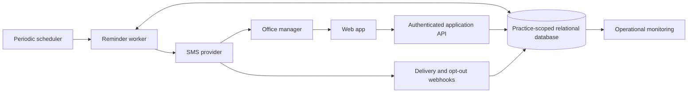

# License Renewal Radar: system design, epics, and stories

Date: 2026-10-03
Status: Proposed product design; no implementation exists in this workspace.

## Research question

What exists in the License Renewal Radar workspace, and how should the requested business solution be organized into a system design and a delivery backlog? The business promise is: keep every state license, DEA registration, and malpractice policy renewal date in one calendar, and text the office manager 60 days before the date.

Interpretation: “design system” means the product and software system design, including its principal screens and interaction rules. A reusable visual component library is not the primary deliverable.

## Summary

Build a practice-scoped web application around a credential register, a unified calendar, and a durable reminder worker. Store explicit dates supplied by the practice; do not calculate renewal dates from assumed regulatory periods. Treat message delivery and renewal completion as separate workflows. A successful text does not mean that a renewal is complete.

The proposed MVP covers practice setup, credential entry, calendar visibility, a 60-day SMS reminder, renewal completion with a new date, delivery failure visibility, access control, and audit history. Imports, calendar subscriptions, extra reminder intervals, and automated document extraction are later enhancements.

## Verified current-state findings

- `/Users/macbookpro/Coding/license-radar/` was empty, including hidden entries other than `.` and `..`, at inspection time.
- `rg --files` and `rg --files --hidden` found no source, manifests, tests, or historical documents.
- `git status --short` returned exit 128 because the directory is not a Git repository. Commit history is unavailable.
- There is no verified monorepo, application, library, symbol, execution flow, or code ownership boundary to describe. All architecture and backlog items below are proposals, not findings about existing software.
- Repository working instructions were supplied in chat. The directly referenced research skill was read at `/Users/macbookpro/.codex/skills/research-codebase/SKILL.md`.
- No existing automated checks or test commands are available. Product acceptance tests below are future implementation criteria.

## Proposed product boundary

### Users and permissions

| Role | Responsibilities | Proposed permissions |
| --- | --- | --- |
| Practice administrator | Set up the practice and manage access | Manage members, settings, recipients, credentials, and audit history |
| Office manager | Monitor dates and complete renewals | Manage credentials, calendar, renewal tasks, and reminder history |
| Clinician or viewer | Check their own records, if invited | Read assigned records; read-only in MVP |

One practice can contain multiple clinicians and practice-owned policies. A clinician can hold multiple licenses and registrations. A malpractice policy can be owned by a clinician or the practice and can optionally link multiple covered clinicians without duplicating the policy or its reminder.

### Scope

MVP: manual entry, practice calendar, date-based urgency, primary manager recipient, verified SMS enrollment, 60-day reminders, immediate catch-up alerts, renewal history, audit history, and operational failure handling.

Later: CSV import/export, optional evidence uploads, calendar subscriptions, backup recipients, 30/7-day reminders, configurable lead times, and document extraction with human confirmation.

The app records and reminds. Filing renewals, interpreting jurisdiction-specific requirements, verifying a license's legal standing, and guaranteeing uninterrupted coverage are outside the MVP. No patient records are needed for the stated workflow.

## Proposed system architecture and ownership

Use one application backend with domain modules and a separately runnable background worker. A relational database stores records, reminder jobs, and audit events. A database-backed job queue/outbox is sufficient initially; a separate queue service is optional later. Keep the calendar derived from the same credential cycles used by the reminder engine.

| Component | Ownership boundary | Main responsibilities |
| --- | --- | --- |
| Identity and practice module | Practice access | Authentication, memberships, roles, tenant authorization |
| Credential module | Credential data | Clinicians, policies, registration metadata, dates, cycle history |
| Calendar module | Read views | Events, filters, dashboard counts; no independent source of dates |
| Reminder module and worker | Notification behavior | Due calculations, jobs, dispatch, retries, reconciliation |
| Provider adapter and webhooks | External messaging | Send requests, provider IDs, signed callbacks, opt-out updates |
| Audit and operations module | Traceability and recovery | Change records, delivery failures, scheduler health, restoration |

These are logical boundaries, not existing packages. Select a concrete framework, database host, and messaging provider before implementation; no stack is currently established in this directory.

## Proposed data model

| Entity | Essential fields and invariants |
| --- | --- |
| Practice | ID, name, IANA timezone, preferred reminder time; initial default 09:00 local |
| Membership | Practice ID, user ID, role, active flag |
| Clinician | Practice ID, name, active flag; optional professional identifier |
| Credential | Practice ID, type (`state_license`, `dea_registration`, `malpractice_policy`), clinician/practice owner, issuer, jurisdiction where applicable, protected identifier, renewal URL, responsible manager, archived flag |
| PolicyCoverage | Credential ID and covered clinician ID; optional for practice policies |
| CredentialCycle | Credential ID, explicit expiration/coverage-end date, optional earlier renewal-action deadline, date revision, workflow state, completed-at, predecessor cycle ID |
| ReminderRecipient | Practice ID, user ID, normalized phone, verification state, consent event/time/version, opt-out state |
| ReminderJob | Practice ID, cycle ID, date revision, recipient ID, lead days, scheduled instant, reason, job state; unique logical reminder key |
| MessageAttempt | Job ID, attempt number, provider message ID, provider status, error class, timestamps; no raw secrets in logs |
| AuditEvent | Practice ID, actor/service ID, entity ID, operation, before/after date or status, timestamp |

Tenant-scoped relationships must also reject references to records from other practices. All read, write, export, and worker paths apply tenant authorization. Internal IDs in links do not grant access.

Keep three independent dimensions:

- Time urgency: more than 60 days, due within 60 days, due today, past due, or missing date.
- Renewal workflow: not started, in progress, awaiting approval, completed.
- Delivery outcome: scheduled, submitting, accepted, delivered, failed, suppressed, or uncertain.

Do not label a pending renewal “current” solely because an application was submitted. Do not label a record legally valid based on its stored date.

## Dates and reminder rules

All rules in this section are proposed defaults requiring product confirmation before implementation.

1. Each cycle has an expiration or coverage-end date and may have an explicitly entered earlier action deadline. The effective reminder date is the earlier action deadline when present; otherwise the expiration/coverage-end date. Display both dates and label which date drives the reminder.
2. Store business dates as date-only values. Schedule the reminder at 09:00 in the practice's timezone, 60 calendar days before the effective date. Compute the UTC execution instant from that local date/time. Timezone changes recompute unsent jobs.
3. A periodic scheduler reconciles due and overdue unsent jobs. A database transaction writes credential changes and the reminder outbox together. A unique logical key `(cycle, date_revision, recipient, lead_days)` and atomic worker claims prevent ordinary duplicate dispatch from concurrent workers.
4. New records already inside the 60-day window create one catch-up reminder at the next permitted local send time. Past-due records are clearly labeled past due. Missing dates create an action-needed item and do not generate a guessed reminder date.
5. Retry only known transient failures with bounded backoff. If a send request times out after the provider may have accepted it, mark it uncertain and reconcile before resending. Do not promise exactly-once SMS delivery across a network boundary.
6. Before dispatch, recheck cycle revision, completion/archive state, responsible recipient, phone verification, consent, and opt-out state. Cancel or suppress obsolete jobs. A text already accepted by the provider may still arrive after an edit or renewal; retain that history.
7. Editing a date increments its revision and replaces unsent jobs. If a notice was already accepted for that cycle and recipient, show it in history and suppress an automatic replacement reminder; provide an audited manual “send updated reminder” action. Completing a renewal creates a new cycle and schedules its new 60-day reminder.
8. Acknowledging a reminder records that somebody saw it; it does not complete the renewal or change the expiration date. Archiving a credential stops unsent reminders and preserves historical records.
9. Recipient reassignment cancels unsent jobs for the previous recipient. If the new recipient is eligible and the cycle is already within the reminder window, create one catch-up reminder for that new recipient.
10. Provider acceptance, handset delivery where reported, and user acknowledgement are distinct. An undelivered or suppressed reminder stays visible in the app with a corrective action.

Example: a cycle with an effective due date of 2026-12-02 schedules its 60-day reminder on 2026-10-03, at the practice's configured local time.

## Execution flow

1. Administrator creates the practice, selects its timezone, invites the office manager, and configures a recipient.
2. Recipient verifies the phone and explicitly enrolls in renewal reminder texts.
3. Manager creates a clinician or practice-owned policy and enters the authoritative date from their records.
4. Backend validates tenant ownership and dates, saves the cycle, audit event, and reminder job atomically.
5. Calendar and dashboard read the saved cycle immediately.
6. Worker finds due jobs, rechecks eligibility, records an attempt, and submits the SMS.
7. Provider callbacks update attempt history and recipient opt-out state. Failures produce an in-app action item and an operational signal.
8. Manager opens the authenticated credential detail, starts the renewal, and records progress.
9. Once renewal is confirmed, manager enters the new date. Backend completes the old cycle, cancels its unsent jobs, creates the successor cycle, and schedules its reminder.

Proposed SMS: “License Renewal Radar: a renewal is due Dec 2. Review it in your practice dashboard: [authenticated link]. Reply STOP to opt out.” Omit full credential numbers and other sensitive detail from message previews. Viewing the link requires authentication and practice access.

### External integration evidence

If Twilio is selected, its messaging policy requires consent, sender identification, and a way to withdraw consent. Design enrollment and opt-out handling accordingly. This is a provider requirement, not a finding about application code or a determination of legal compliance. [Twilio Messaging Policy](https://www.twilio.com/en-us/legal/messaging-policy).

Twilio exposes asynchronous outbound status callbacks. Use them to distinguish submission from delivery and failure, rather than treating a successful send API call as proof that the manager received the text. [Outbound Message Status in Status Callbacks](https://www.twilio.com/docs/messaging/guides/outbound-message-status-in-status-callbacks).

## Product interaction design

| Screen | Purpose | Primary action |
| --- | --- | --- |
| Dashboard | Show due within 60 days, past due, missing dates, and failed reminders | Review an item needing action |
| Calendar | One month/list calendar for all three credential types | Open a credential or add a record |
| Credential register | Search and filter by clinician, type, jurisdiction, owner, or urgency | Add/edit/archive a record |
| Credential detail | Dates, owner, renewal link, workflow, cycle history, and reminder history | Start renewal or record renewed date |
| Practice settings | Timezone, members, responsible manager, SMS enrollment | Resolve recipient readiness |

Use labeled status badges with icons; color is supplementary. Calendar events show owner, type, and date purpose. Mobile layouts default to a readable agenda. Provide keyboard navigation, readable error messages, explicit timezone labels, and confirmation before completing a cycle or archiving a credential.

## Epics and user stories

Priority: P0 = MVP launch requirement; P1 = subsequent usability/reliability enhancement; P2 = later automation. Acceptance criteria are proposed executable requirements, not existing tests.

### E1 — Practice setup and access

Outcome: each practice has a clear responsible manager and isolated records.

| ID | Priority | Story | Acceptance criteria |
| --- | --- | --- | --- |
| E1-S1 | P0 | As an administrator, I can create a practice and configure its timezone so reminders arrive at the intended local time. | Name/timezone are required; invalid timezone is rejected; reminder preview shows local date/time; settings persist. |
| E1-S2 | P0 | As an administrator, I can invite a manager and assign roles so authorized staff can maintain records. | Invitations expire; roles follow the permission table; revoked members lose access; a practice cannot lose its last administrator. |
| E1-S3 | P0 | As a manager, I can assign or replace the responsible reminder recipient so responsibility stays current. | Recipient belongs to the practice; readiness is displayed; reassignment follows rule 9 and is audited. |

Dependencies: identity foundation. Cross-practice isolation also belongs to E7 and is required from the first data endpoint.

### E2 — Credential register

Outcome: one reliable inventory of licenses, registrations, and policies.

| ID | Priority | Story | Acceptance criteria |
| --- | --- | --- | --- |
| E2-S1 | P0 | As a manager, I can create clinician and practice-owned records so all renewal types can be represented. | Multiple records per clinician are supported; shared policies can link multiple clinicians without duplicate reminders; owners stay within the practice. |
| E2-S2 | P0 | As a manager, I can add a state license, DEA registration, or malpractice policy with its dates so the system can track it. | Type-specific issuer/jurisdiction fields are supported; dates are explicit; invalid dates are rejected; an earlier action deadline is distinguishable from expiration; unknown dates are flagged. |
| E2-S3 | P0 | As a manager, I can edit or archive records so the register stays accurate. | Suspected duplicates are flagged for review; date edits update unsent reminder jobs; archiving hides active events and cancels unsent jobs; audit history remains. |
| E2-S4 | P1 | As a manager, I can import a CSV so I can migrate my spreadsheet. | Preview identifies invalid/duplicate rows; importing is explicit; row results are reported; repeating the same confirmed import does not silently create duplicate records. |

Dependencies: E1. Import remains optional for manual-entry MVP.

### E3 — Unified calendar and dashboard

Outcome: the manager can see every entered renewal date in one place.

| ID | Priority | Story | Acceptance criteria |
| --- | --- | --- | --- |
| E3-S1 | P0 | As a manager, I can view all renewal dates in one calendar and agenda so I can plan ahead. | All three credential types appear; filters cover clinician/type/jurisdiction; date purpose is labeled; event opens authorized detail; phone-sized screens support agenda view. |
| E3-S2 | P0 | As a manager, I can see due, past-due, and missing-date items so I can prioritize work. | Counts and lists use the same date rules; missing dates remain visible; “in progress” does not hide a past-due date; badges include text. |
| E3-S3 | P1 | As a manager, I can subscribe from an external calendar so dates appear where I already work. | Read-only feed uses stable event IDs and updates; credential numbers are omitted; access can be revoked; calendar refresh limitations are disclosed. |

Dependencies: E2; basic filtering and urgency are MVP.

### E4 — Reliable 60-day SMS reminders

Outcome: an eligible manager receives a timely reminder, and failure is visible.

| ID | Priority | Story | Acceptance criteria |
| --- | --- | --- | --- |
| E4-S1 | P0 | As a manager, I can verify my phone and choose to receive reminder texts so messages reach the correct recipient. | Verification and consent are separate recorded steps; sender/purpose/opt-out are explained; opt-out suppresses future dispatch; lack of readiness is visible. |
| E4-S2 | P0 | As a manager, I receive a text 60 calendar days before the configured due date so I have time to renew. | Scheduling uses practice timezone; reminders include due date and authenticated link; concurrent scheduler runs create one logical job; completed/archived cycles are rechecked before send. |
| E4-S3 | P0 | As a manager, I receive a catch-up alert for newly entered or reassigned items already inside 60 days so late setup does not hide risk. | One catch-up per eligible cycle/revision/recipient; due-today and past-due text is accurate; missing dates do not schedule invented alerts; failed scheduler runs are reconciled. |
| E4-S4 | P0 | As a manager, I can see message history and resolve delivery problems so a failed text does not silently disappear. | Accepted/delivered/failed/suppressed/uncertain states differ; transient retries are bounded; opt-outs and permanent failures are not retried automatically; uncertain submissions are reconciled before resend. |

Dependencies: E1, E2, E7; signed webhooks and worker health are launch requirements.

### E5 — Renewal workflow and history

Outcome: a reminder becomes completed work and a new renewal cycle.

| ID | Priority | Story | Acceptance criteria |
| --- | --- | --- | --- |
| E5-S1 | P0 | As a manager, I can open a renewal link and track progress so I know which items need action. | Not-started/in-progress/awaiting-approval states persist; acknowledgement is distinct; changing workflow status alone does not extend the date. |
| E5-S2 | P0 | As a manager, I can record a confirmed renewal and its new date so the next reminder is scheduled. | New future date is required; old cycle is preserved; duplicate submissions do not create duplicate successor cycles; old unsent jobs are canceled; new cycle has a 60-day job. |
| E5-S3 | P1 | As a manager, I can attach renewal evidence so I can substantiate completion. | Files are private and tenant-authorized; type/size restrictions apply; upload/access/deletion are audited; evidence does not automatically set a renewal date. |

Dependencies: E2 and E4.

### E6 — Escalation and continuity

Outcome: renewal ownership and unresolved reminders survive staff changes.

| ID | Priority | Story | Acceptance criteria |
| --- | --- | --- | --- |
| E6-S1 | P1 | As an administrator, I can assign a backup manager so unresolved items have another owner. | Backup is an authorized practice member; any SMS recipient independently verifies and consents; escalation history identifies the recipient. |
| E6-S2 | P1 | As a manager, I can enable 30-day and 7-day follow-ups so unfinished renewals stay visible. | Follow-ups are optional; use separate logical keys; completed cycles suppress unsent follow-ups; urgency matches the current date. |
| E6-S3 | P1 | As an administrator, I can see items with no eligible recipient so changes in staffing or opt-outs do not create hidden gaps. | Dashboard highlights missing/revoked/opted-out recipients; reassignment creates catch-up where appropriate; no silent use of an unconsented phone. |

Dependencies: E1, E4, E5. Basic readiness and suppression visibility are already P0 under E1/E4; this epic adds broader continuity tools.

### E7 — Data protection and auditability

Outcome: records remain private, traceable, and recoverable.

| ID | Priority | Story | Acceptance criteria |
| --- | --- | --- | --- |
| E7-S1 | P0 | As a practice administrator, I can trust that other practices cannot access our records. | Negative access tests cover API reads/writes, links, exports, and worker paths; cross-practice foreign references are rejected; permissions are enforced server-side. |
| E7-S2 | P0 | As an administrator, I can inspect who changed a date, recipient, or renewal status so I can resolve discrepancies. | Audit events capture actor/time/before-after; date changes and manual sends are included; ordinary users cannot alter audit events. |
| E7-S3 | P0 | As an administrator, I can rely on protected storage and recoverable data so an operational error does not erase the register. | Transport/storage encryption is configured; identifiers are omitted from SMS/logs; signed provider callbacks are validated; backup restoration is demonstrated; retention/deletion behavior is documented. |

Dependencies: foundation implemented alongside E1/E2, not after product features.

### E8 — Operations and later automation

Outcome: the team can detect missed reminders and reduce entry effort over time.

| ID | Priority | Story | Acceptance criteria |
| --- | --- | --- | --- |
| E8-S1 | P0 | As an operator, I can detect a stalled scheduler or reminder backlog so I can recover before reminders are missed. | Track scheduler heartbeat, due-job lag, failures, and uncertain submissions; alert to an internal operational channel; replay respects logical job keys and current eligibility. |
| E8-S2 | P1 | As a manager, I can export upcoming dates and completion history so I can review the practice's workload. | Export is authorized and filtered; dates match the register; includes workflow and delivery state; confidential identifiers are omitted by default. |
| E8-S3 | P2 | As a manager, I can extract suggested fields from a document so setup is faster. | Extraction is a draft with provenance; manager confirms dates before scheduling; low-confidence/missing fields remain flagged; unsupported documents have a manual-entry path. |

Dependencies: E4/E7 for monitoring; E2/E5 for reporting and extraction.

## Suggested delivery order

| Slice | Contents | Exit criterion |
| --- | --- | --- |
| 1 — Foundation and register | E1 P0, E2 P0, E7 foundations | Two isolated practices can manage all three credential types with correct dates and roles. |
| 2 — Visibility | E3 P0 | Calendar and dashboard agree with stored cycles, including missing and past-due records. |
| 3 — Reminder delivery | E4 P0, E8-S1, remaining E7 P0 | A due reminder submits; callback/failure/opt-out paths work; concurrent/replayed jobs remain controlled; restoration is demonstrated. |
| 4 — Renewal completion | E5 P0 | Completing a cycle preserves history, cancels stale unsent reminders, and schedules the successor. |
| 5 — Adoption and resilience | P1 stories | Import, calendar subscription, evidence, follow-ups, backup ownership, and exports meet their individual criteria. |

MVP means slices 1–4; a calendar without a reliable reminder worker and completion flow does not fulfill the business promise.

## Future verification plan and proposed success measures

Automated acceptance coverage should include:

- Date arithmetic across month/year/leap-day boundaries and daylight-saving changes; fixed practice-local scheduling.
- New entries at 61, 60, 59, 0, and negative days until due; missing-date behavior; outages followed by catch-up.
- Concurrent workers, repeat scheduler runs, stale jobs after date edits, recipient reassignment, and duplicate renewal submissions.
- Transient failures, terminal failures, ambiguous provider timeout, duplicate/out-of-order callbacks, opt-out before dispatch, and invalid callback signatures.
- Cross-practice access rejection and authorization on every record and reminder detail path.
- Calendar/dashboard consistency and preserved renewal/audit history.

Manual launch checks: mobile agenda and keyboard use; verified test-phone enrollment and opt-out; actual delivery receipt where the provider supports it; recipient replacement; demonstrated backup restore and outage recovery. These have not been run because no application exists.

Proposed operational targets, to validate with the eventual infrastructure: eligible scheduled reminders submitted within 15 minutes of their target time; stale scheduler/backlog detected within 15 minutes; no unreported failed or suppressed jobs; all confirmed renewals create a successor cycle. Track delivery rate separately from submission timeliness because carriers and recipient devices affect delivery. Track renewal completion before the entered due date as the business outcome.

## Open questions before implementation

1. Is the initial customer a single-location practice or a group with multiple locations and responsible managers? Default proposal: one tenant per practice, multiple clinicians, one primary recipient per credential.
2. Does “60 days out” refer to expiration, a renewal filing deadline, or whichever requires earlier action? Default proposal: use the explicitly entered earlier action deadline when present and clearly label it.
3. Is the in-app calendar sufficient for launch, or is Google/Outlook subscription mandatory? Default proposal: in-app calendar first.
4. Should the first release include CSV import and document evidence? Default proposal: manual entry first; evidence optional later.
5. Which hosting, identity, database, and SMS providers will be used? Select these before writing provider-specific code; provision and test the chosen sender before launch.
6. Who owns the authoritative inventory and confirms dates? Default proposal: office manager confirms every date; the app never assumes it knows every required credential.
7. What retention period, pilot practice size, delivery target, and recovery objective are appropriate? These affect cost and launch checks and remain unconfirmed.

## Research and document verification

Inspection commands: `pwd`, `rg --files` (excluding common dependency/build folders), `ls -la /Users/macbookpro/Coding/license-radar`, `rg --files --hidden`, `git status --short`, and complete reading of the invoked research skill. Results: empty directory, no implementation or historical files, no Git metadata.

This document is the only proposed repository artifact. No production files, application behavior, deployments, or external backlog items were created. Implementation lint/type/test checks are unavailable; acceptance criteria specify the work to verify when code exists.
